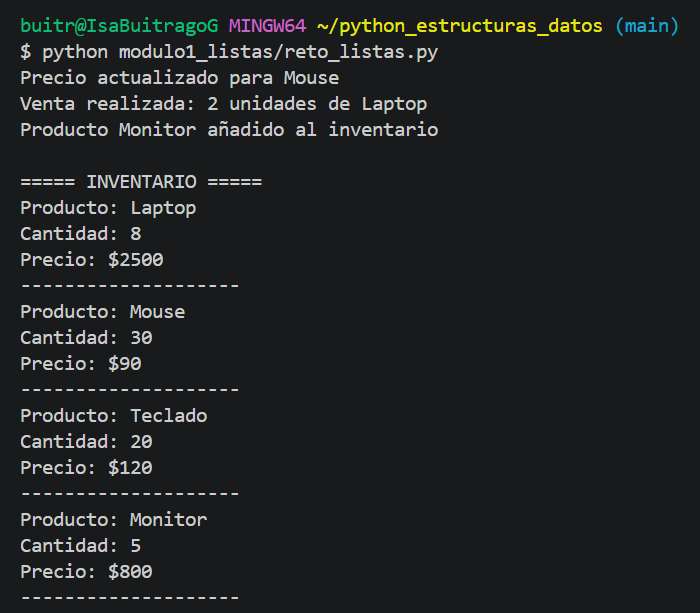
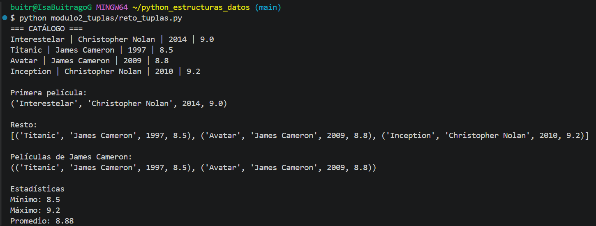
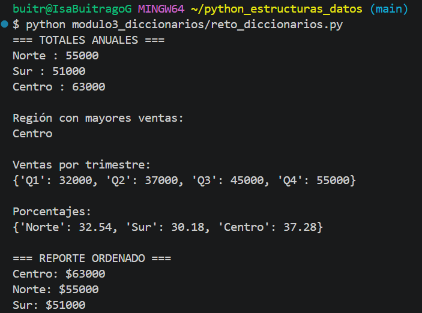
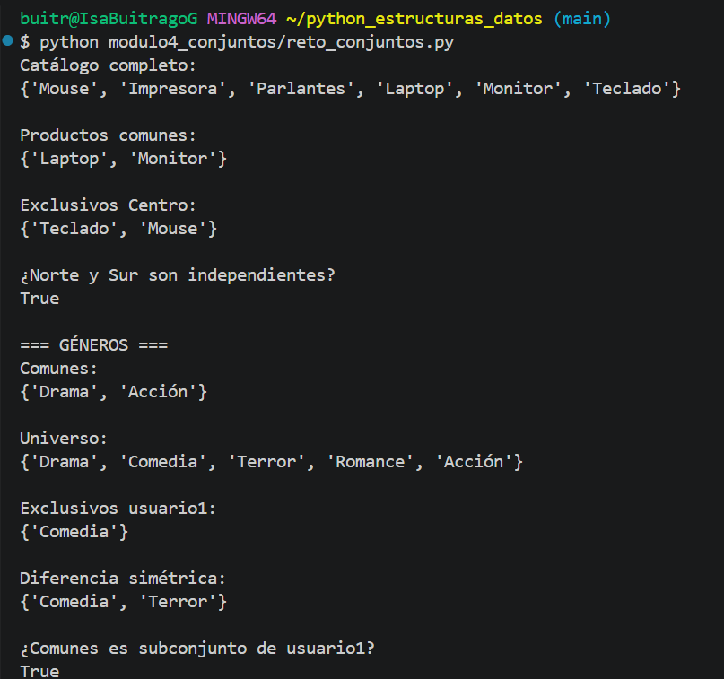
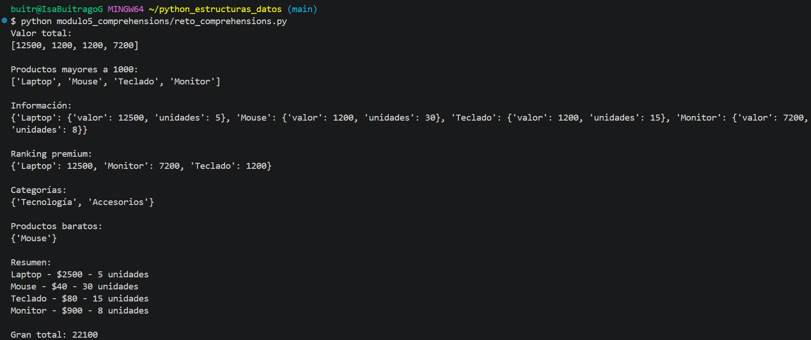

# Fundamentos de Python: Estructuras de Datos

## Información de la actividad

**Programa:** Análisis y Desarrollo de Software

**Evidencia:** GA1-220501093-AA1-EV03 – Fundamentos de Python: Estructuras de Datos en Python

**Aprendiz:** Isabuitrago

---

## Descripción del proyecto

Este proyecto fue desarrollado con el propósito de aplicar los conocimientos adquiridos sobre las principales estructuras de datos en Python.

Durante el desarrollo de la actividad se resolvieron retos prácticos relacionados con listas, tuplas, diccionarios, conjuntos y comprehensions, permitiendo fortalecer habilidades de programación y resolución de problemas.

---

## Estructura del proyecto

```text
python_estructuras_datos
│
├── modulo1_listas
│   └── reto_listas.py
│
├── modulo2_tuplas
│   └── reto_tuplas.py
│
├── modulo3_diccionarios
│   └── reto_diccionarios.py
│
├── modulo4_conjuntos
│   └── reto_conjuntos.py
│
├── modulo5_comprehensions
│   └── reto_comprehensions.py
│
├── images
│
└── README.md
```

---

## Temas aprendidos

### Listas

Las listas permiten almacenar y modificar colecciones de datos de forma dinámica.

### Tuplas

Las tuplas permiten almacenar información de manera ordenada y segura, ya que sus elementos no pueden modificarse.

### Diccionarios

Los diccionarios permiten relacionar claves con valores, facilitando el almacenamiento estructurado de información.

### Conjuntos

Los conjuntos permiten trabajar con elementos únicos y realizar operaciones matemáticas como unión, intersección y diferencia.

### Comprehensions

Las comprehensions permiten crear listas, diccionarios y conjuntos de forma más eficiente y compacta.

---

## Retos desarrollados

### Módulo 1 – Listas

Se desarrolló un sistema de inventario capaz de:

* Actualizar precios.
* Registrar ventas.
* Agregar nuevos productos.
* Mostrar el inventario actualizado.

### Módulo 2 – Tuplas

Se creó un catálogo de películas que permite:

* Mostrar información mediante desempaquetado.
* Buscar películas por director.
* Obtener estadísticas de puntuación.

### Módulo 3 – Diccionarios

Se realizó un análisis de ventas por región:

* Cálculo de ventas anuales.
* Región con mayores ventas.
* Acumulación por trimestre.
* Cálculo de porcentajes.
* Generación de reportes ordenados.

### Módulo 4 – Conjuntos

Se implementaron operaciones entre conjuntos para:

* Gestionar catálogos de productos.
* Identificar elementos comunes.
* Encontrar diferencias y exclusividades.
* Analizar preferencias de usuarios.

### Módulo 5 – Comprehensions

Se utilizaron comprehensions para:

* Calcular valores totales.
* Filtrar productos.
* Crear diccionarios y conjuntos.
* Generar reportes automáticos.

---

## Evidencias de ejecución

### Reto Listas



### Reto Tuplas



### Reto Diccionarios



### Reto Conjuntos



### Reto Comprehensions



---

## Reflexión personal

La realización de esta actividad me permitió comprender mejor el uso de las estructuras de datos en Python y la importancia de seleccionar la estructura adecuada según el problema a resolver.

Además, fortalecí mis conocimientos en organización de proyectos, documentación de código y uso de Git y GitHub para el control de versiones y la gestión de repositorios.

Estas herramientas serán de gran utilidad para futuros desarrollos de software y proyectos académicos.
